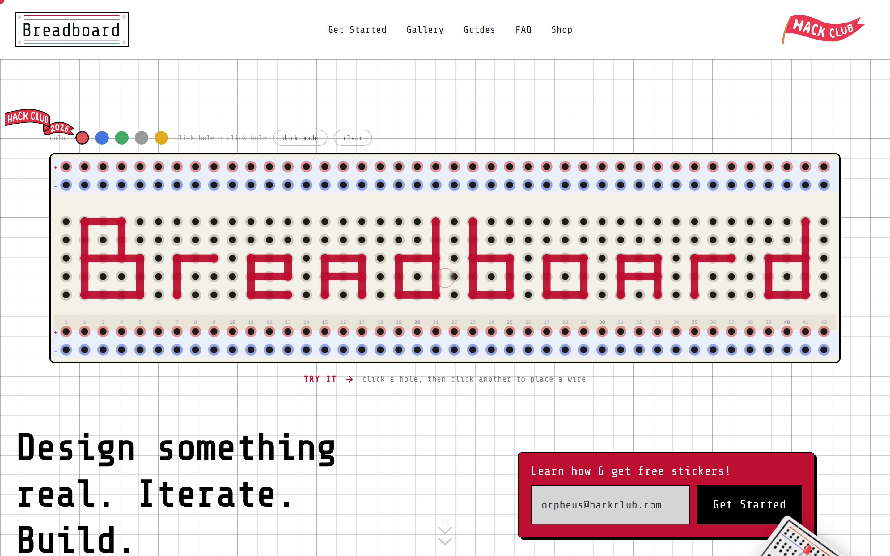
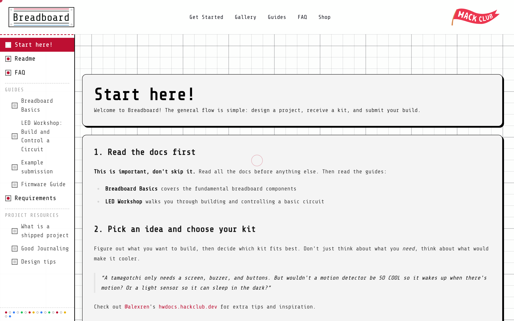
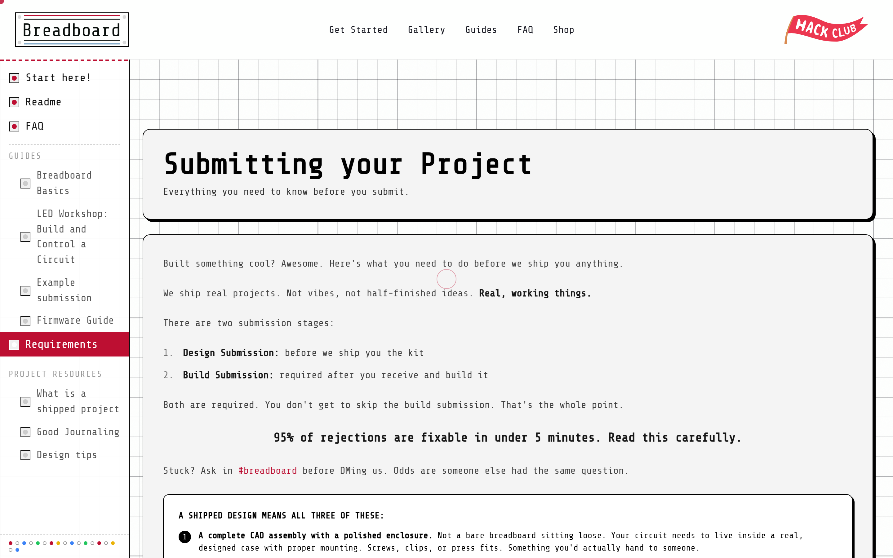

<a id="readme-top"></a>

<p align="center">
  
</p>

<p align="center">
  <a href="https://svelte.dev/docs/kit/introduction">
    
  </a>
  <a href="https://svelte.dev/docs/svelte/what-are-runes">
    
  </a>
  <a href="https://tailwindcss.com/">
    
  </a>
  <a href="https://www.typescriptlang.org/">
    
  </a>
  <a href="https://supabase.com/">
    
  </a>
</p>

<div align="center">
  <h3>Breadboard</h3>
  <p>
    <strong>Design a complete breadboard project. We send you the kit to build it.</strong><br />
    The original pitch site and docs for Breadboard, a Hack Club YSWS program.
  </p>
  <p>
    <a href="https://github.com/hackclub/breadboard"><strong>Current version: hackclub/breadboard »</strong></a><br />
    <a href="https://breadboard.hackclub.com">breadboard.hackclub.com</a>
  </p>
</div>

> [!NOTE]
> **This is the first version of Breadboard, and it is no longer updated.**
>
> I built it as my initial pitch for a Hack Club internship. 
>
> Breadboard shipped as a real program, and the current codebase lives at [hackclub/breadboard](https://github.com/hackclub/breadboard) running at [breadboard.hackclub.com](https://breadboard.hackclub.com). 

<details>
  <summary>Table of Contents</summary>
  <ol>
    <li><a href="#about-the-project">About The Project</a></li>
    <li><a href="#screenshots">Screenshots</a></li>
    <li><a href="#why-i-made-it">Why I Made It</a></li>
    <li><a href="#built-with">Built With</a></li>
    <li><a href="#how-it-works">How It Works</a></li>
    <li>
      <a href="#quick-start">Quick Start</a>
      <ul>
        <li><a href="#prerequisites">Prerequisites</a></li>
        <li><a href="#install">Install</a></li>
        <li><a href="#run">Run</a></li>
        <li><a href="#build">Build</a></li>
      </ul>
    </li>
    <li><a href="#credits">Credits</a></li>
    <li><a href="#contact">Contact</a></li>
  </ol>
</details>

## About The Project

Breadboard is a Hack Club YSWS program (You Ship, We Ship): design a real breadboard project, submit the design, get a free component kit. This repo is the SvelteKit site I built to pitch it, covering the landing page, the program docs, and an email signup form.

It's my project for Horizons (`#horizons` on the Hack Club Slack).

## Screenshots



<!--  -->



<!---->

## Why I Made It

I wanted to run a program where users can iterate if their design fails, and have fun making hands-on projects.

## Built With

SvelteKit 2 on Svelte 5 runes, Tailwind CSS 4, TypeScript. Google's [`<model-viewer>`](https://modelviewer.dev/) for the 3D preview, Supabase for signups, Paraglide (inlang) for localized routing, Vercel Analytics, mdsvex in the preprocessor chain. Vitest for unit and component tests, Playwright for end-to-end.

## How It Works

The landing page (`src/routes/+page.svelte`) composes components from `src/lib/components`: the interactive canvas breadboard, the signup card, three step cards, and the FAQ cards.

The docs are a dozen routes sharing a `DocsFrame` wrapper for the header, sidebar, and footer. Content covers getting started, kit contents, breadboard basics, an LED workshop, firmware setup, journaling, design tips, and submission requirements.

The signup form posts to a SvelteKit form action. The server validates the address, then tries Supabase, a Postgres connection string, and `data/email-signups.json` in that order, taking whichever works first. Duplicates count as success.

## Quick Start

### Prerequisites

- Node.js 20+
- npm

### Install

```bash
npm install
```

### Run

```bash
npm run dev
```

Serves at http://localhost:5173 with no configuration. Without env vars, signups append to `data/email-signups.json`, which is enough to test the form.

For a real database, add a `.env`:

```
SUPABASE_URL=...
SUPABASE_SERVICE_ROLE_KEY=...
```

or set `DATABASE_URL` (`POSTGRES_URL` works too). The Postgres path creates the `email_signups` table on first write.

### Build

```bash
npm run build
```

## Credits

- [Hack Club](https://hackclub.com): Breadboard runs as a Hack Club YSWS program, and the flag, banner, and kit photography are Hack Club assets.
- [`<model-viewer>`](https://modelviewer.dev/) by Google: the 3D preview on the landing page.
- [hwdocs.hackclub.dev](http://hwdocs.hackclub.dev) by [@alexren](https://github.com/qcoral/): used for some docs! 

## Contact

Tanishq Goyal - @Tanuki - [tanishqgoyal590@gmail.com](mailto:tanishqgoyal590@gmail.com)

<p align="right">(<a href="#readme-top">back to top</a>)</p>
